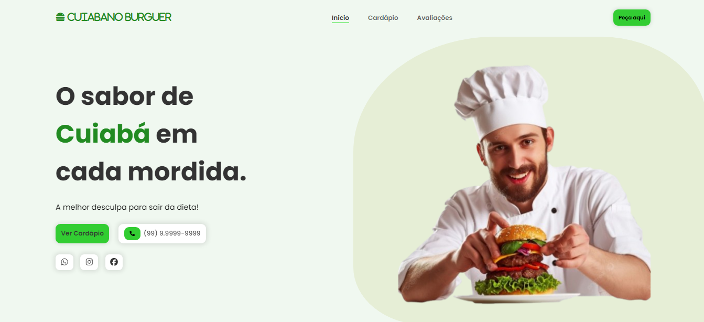

<div style="color:#228b22; display: flex; align-items: center; justify-content: center; gap: 10px;">
<svg xmlns="http://www.w3.org/2000/svg" viewBox="0 0 512 512" width="50px" fill="#228b22"><path d="M61.1 224C45 224 32 211 32 194.9c0-1.9 .2-3.7 .6-5.6C37.9 168.3 78.8 32 256 32s218.1 136.3 223.4 157.3c.5 1.9 .6 3.7 .6 5.6c0 16.1-13 29.1-29.1 29.1L61.1 224zM144 128a16 16 0 1 0 -32 0 16 16 0 1 0 32 0zm240 16a16 16 0 1 0 0-32 16 16 0 1 0 0 32zM272 96a16 16 0 1 0 -32 0 16 16 0 1 0 32 0zM16 304c0-26.5 21.5-48 48-48l384 0c26.5 0 48 21.5 48 48s-21.5 48-48 48L64 352c-26.5 0-48-21.5-48-48zm16 96c0-8.8 7.2-16 16-16l416 0c8.8 0 16 7.2 16 16l0 16c0 35.3-28.7 64-64 64L96 480c-35.3 0-64-28.7-64-64l0-16z"/></svg>
<span style="font-size: 2.5em; font-weight: bold;">CUIABANO BURGUER</span>
</div>

<br>

<div align="center">
  <a href="#-projeto">👨‍💻 Projeto</a>&nbsp;&nbsp;&nbsp;|&nbsp;&nbsp;&nbsp;
  <a href="#-tecnologias">🚀 Tecnologias</a>&nbsp;&nbsp;&nbsp;|&nbsp;&nbsp;&nbsp;
  <a href="#-funcionalidades">💻 Funcionalidades</a>&nbsp;&nbsp;&nbsp;|&nbsp;&nbsp;&nbsp;
  <a href="#-prévia-do-projeto">📷 Prévia do Projeto</a>&nbsp;&nbsp;&nbsp;|&nbsp;&nbsp;&nbsp;
  <a href="#-executar-aplicação">🔥 Executar Aplicação</a>&nbsp;&nbsp;&nbsp;|&nbsp;&nbsp;&nbsp;
  <a href="#-melhorias-futuras">📌 Melhorias Futuras</a>&nbsp;&nbsp;&nbsp;|&nbsp;&nbsp;&nbsp;
  <a href="#-licença">📄 Licença</a>&nbsp;&nbsp;&nbsp;|&nbsp;&nbsp;&nbsp;
  <a href="#-autor">👨‍💻 Autor</a>&nbsp;&nbsp;&nbsp;|&nbsp;&nbsp;&nbsp;
  <a href="#-agradecimento">🤝 Agradecimento</a>
</div>

<br>

<div align="center">
  
  
  
</div>

<br>


## 👨‍💻 Projeto

Landing page interativa desenvolvida para a hamburgueria **Cuiabano Burguer**, trazendo um design moderno e dinâmico para apresentar os produtos e serviços de forma atrativa.

Acessar Site Cuiabano Burguer **[Clique aqui](https://professor-wanderson-timoteo.github.io/cuiabano-burguer/)**

<br>

## 🚀 Tecnologias

<div align="center">
  
  
  
  
</div>  

- **HTML5** → Estruturação do projeto
- **CSS3** → Estilização e responsividade
- **JavaScript** → Funcionalidades interativas
- **ScrollReveal** → Animações suaves ao rolar a página

<br>

## 💻 Funcionalidades

✅ **Design responsivo** para diferentes dispositivos 📱💻  
✅ **Animações suaves** ao rolar a página ✨  
✅ **Interface moderna e intuitiva** 🎨  
✅ **Código organizado e escalável** 🔧  
✅ **Otimizado para performance e carregamento rápido** 🚀  

<br>

## 📷 Prévia do Projeto



<br>

## 🔥 Executar Aplicação

### 🎇 Executando Localmente a Aplicação

Caso você deseja executar o projeto na sua máquina local, você precisará clonar o projeto, para isso, basta seguir os passos abaixo:

### 🌀 Clonar o repositório

Para começar, você deve simplesmente clonar o repositório do projeto na sua máquina.

Navegue até o local onde você clonou o projeto, exemplo:

```sh
C:\Users\NomeDoComputador\Documents\CloneDoProjeto
```

<br>

### 🛰️ Executando o projeto

Para executar sugiro que abra o projeto com a IDE VSCode.
Se estiver usando o VSCode é só instalar a extensão Live Server.
Agora é só executar o arquivo index.html com a extensão Live Server, clique com botão esquerdo do mouse sobre o index.html e selecione a opção **Open with Live Server**.

Pronto! dessa forma o projeto `Cuiabano Burguer` estará rodando localmente em sua maquina. Acesse no navegador o endereço abaixo:

```
http://127.0.0.1:5500/index.html
```

<br>

## 🚩 Tenho Dúvidas... O que fazer?

Caso tenha dúvidas sobre o código do projeto, sintam-se a vontade em abrir uma **[ISSUE AQUI](https://github.com/professor-wanderson-timoteo/cuiabano-burguer/issues)**. Assim que possível, responderei todas as dúvidas!

<br>

## 📌 Melhorias Futuras
- Implementação de um sistema de pedidos online 🛒
- Integração com API para gestão do cardápio 📊
- Animações adicionais para maior interatividade ✨

## 📄 Licença

<p>Este projeto é de código aberto e pode ser utilizado para estudos e aprimoramento. 📜</p>

Para mais detalhes sobre a licença: [clique aqui](.github/LICENSE)

<br>

## Autor

<div align="center">  

<br> 

💡 **Desenvolvido por [Wanderson Timóteo](https://github.com/professor-wanderson-timoteo)** </div>

<br> 

## 🤝 Agradecimento

<p>Agradecimento especial a <strong>Larissa Kich</strong> pelo template utilizado como base para o projeto! 🎨🙌</p>

<p>Obrigado por compartilhar seu conhecimento e contribuir com a comunidade! 🎉</p>